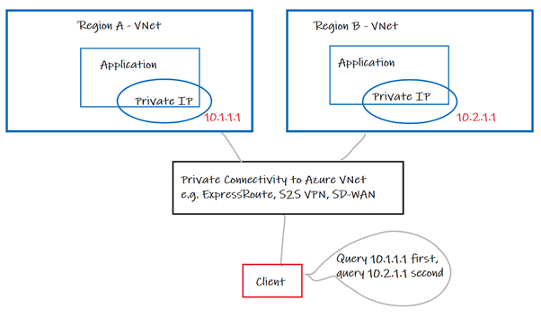
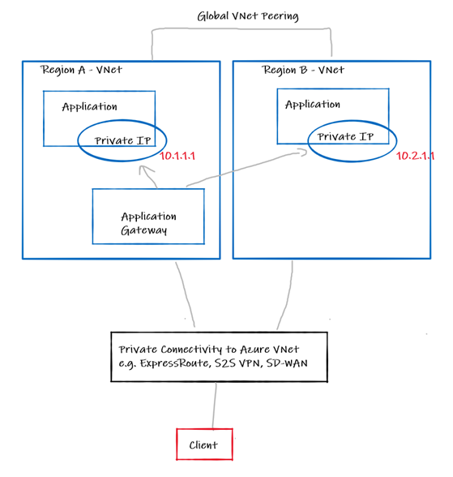

# Cross-region private network load balancing in Azure

# Contents

- [Introduction](#introduction)
- [Option 1 – Code the complexity](#option-1---code-the-complexity)
- [Option 2 - 3rd party GSLB Network Virtual Appliance (NVA)](#option-2---3rd-party-gslb-network-virtual-appliance--nva-)
- [Option 3 - Azure Traffic Manager](#option-3---azure-traffic-manager)
- [Option 4 - Azure Front Door](#option-4---azure-front-door)
- [Option 5 - Azure Load Balancer](#option-5---azure-load-balancer)
- [Option 6 - Application Gateway](#option-6---application-gateway)
- [Closing](#closing)

# Introduction

The subject of load balancing across Azure regions is a common topic within application design in the Cloud. Often in the context of providing HA or DR for an application hosted in Azure, but also for purposes of load sharing and/or [blue-green deployments](https://en.wikipedia.org/wiki/Blue-green_deployment).

If the source, remote endpoints (clients, APIs, etc), are accessing the applications from a *public source* (public IP, over the Internet) then we have well known patterns that many customers already use, comprised of products like Azure Front Door and Azure Traffic Manager – these products sit at the edge of the Microsoft network, and can therefore naturally intercept requests from clients on the Internet, before the traffic is passed to an Azure Region. E.g., https://docs.microsoft.com/en-us/azure/architecture/reference-architectures/app-service-web-app/multi-region

However, exploring the ability to provide a network load balancing strategy across regions for endpoints accessing an application from a **private network**, is also something that gets raised from time to time. The purpose of this article is to discuss the options in this area. This is done at a high level to provide the available approaches, which in themselves will require you to investigate their implementation details.

*Please pay attention to the last updated date of this doc, Azure features move fast, and this may be out of date.*

# Option 1 – Code the complexity

Ok, this is probably not a viable option if you are reading this doc, but it’s good to step-back, and acknowledge that this is a technical approach that would solve the problem. If you have control of the client, you can code the application to query multiple endpoints, which resolve to multiple private IPs in different regions. I.e., the client decides what endpoint to query, and when, based on logic in the client, and reachability of the endpoint. The network just routes packets based on IP destination.

# Option 2 - 3rd party GSLB Network Virtual Appliance (NVA)

Azure supports Network Virtual Appliances (NVA) from most popular vendors, including Global Server Load Balancing (GSLB) products such as F5 BIG-IP and the associated DNS/GTM module that includes GSLB. The details of such solutions are relatively complex, but in short you collocate an NVA in each region next to your application, they sync with each other to present a floating FQDN that your client can use, responding with the according A record (IP) depending on your configuration, and reachability of the NVA itself. This involves making the NVA server authoritative for resolution of your internal forward lookup zone. Consider this like building your own mini Traffic Manager solution in your Virtual Network(s). As this solution is DNS based, you need to pay attention to things like DNS TTL and cache timeout.

# Option 3 - Azure Traffic Manager

*Warning, I do not recommend this option!*

You may have seen this article floating around forums etc https://docs.microsoft.com/en-us/archive/blogs/mihansen/using-azure-traffic-manager-for-private-endpoint-failover-manual-method

In short, you can use manual failover with Traffic Manager to return Private IPs (A records) via the a public resolver. However, this is undesirable for several reasons:

-	Failover is a manual process
-	Your private A records are resolvable publicly
-	You still need to send the DNS query over the Internet, so you still need public connectivity, lots of folks reading this will be designing for “off grid” deployments. I.e., internal stuff only, no internet

But still, if you are in a pinch, it is *technically* possible.

# Option 4 - Azure Front Door

Spoiler, this isn’t an option today! However, it’s worth calling out a point of confusion I’ve seen with the recent announcements around the Azure Front Door Premium SKU. In this SKU, currently in preview, we support the ability to communicate with your Origin in a private way. https://docs.microsoft.com/en-us/azure/frontdoor/standard-premium/concept-private-link. This is very different to having a private front end, but still cool, nevertheless.

# Option 5 - Azure Load Balancer

Ok this is another option that is **not really an option**, sorry. But I’m including it to clarify an existing product offering and show you where to request an enhancement. Azure Load Balancer does support, in preview, cross-region load balancer which is super awesome. https://docs.microsoft.com/en-us/azure/load-balancer/cross-region-overview. However, in its current form, we only support a *public* global front end IP. https://docs.microsoft.com/en-us/azure/load-balancer/cross-region-overview

If you want this feature expanded to include *private* global front end IPs, add your feedback here! 
https://feedback.azure.com/forums/217313-networking/suggestions/41857570-support-ilb-for-cross-region-lb-global-private-l

# Option 6 - Application Gateway

Depending on the failover/failure scenario you are trying to cater for, this topology could be an option for you today on the platform.

Application Gateway (APGW) is a full HTTP/S reverse proxy managed by Microsoft that lives in your VNet. The latter point “*in your VNet*” being the key point for this option. APGW is pinned to a VNet and therefore a region, and supports full use of Availability Zones now, https://docs.microsoft.com/en-us/azure/application-gateway/application-gateway-autoscaling-zone-redundant

You can combine this with Global VNet peering, to build a backend pool that comprises of endpoints in multiple regions. The caveat here of course, is that you need the region to be online for your solution to work, therefore you are only catering for load distribution as well as failure scenarios that involve your backend failing. If a region fails, you need to manually swing your DNS to point at a APGW instance in region B. This, however, may be a perfectly acceptable part of your Disaster Recovery runbook, but your mileage may vary, depending on your requirements, RPO, RTO etc

# Closing

Despite this document not proposing an entirely elegant solution, I do hope it helps you approach the topic and understand the current options and constraints.

PS. Hat tip to new feature in the portal that can kick start your decision-making process in this area. https://docs.microsoft.com/en-us/azure/architecture/guide/technology-choices/load-balancing-overview#choose-a-load-balancing-solution-using-azure-portal
